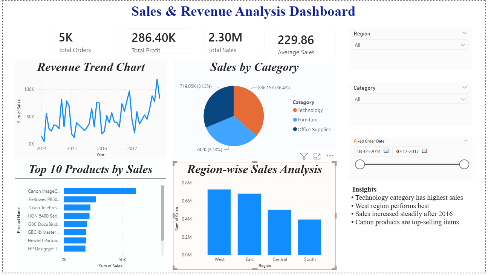

# Sales & Revenue Analysis Dashboard

## Dashboard Preview

## Project Overview
This project was developed as part of my internship at Thiranex.  
The dashboard analyzes sales and revenue data using interactive visualizations and KPI tracking in Power BI.

## Features
- KPI Cards
- Revenue Trend Analysis
- Sales by Category
- Top 10 Products Analysis
- Region-wise Sales Analysis
- Interactive Filters & Slicers

## Tools Used
- Power BI
- CSV Dataset
- Data Visualization
- Business Analytics

## Key Insights
- Technology category has highest sales
- West region performs best
- Sales increased steadily after 2016
- Canon products are top-selling items 
